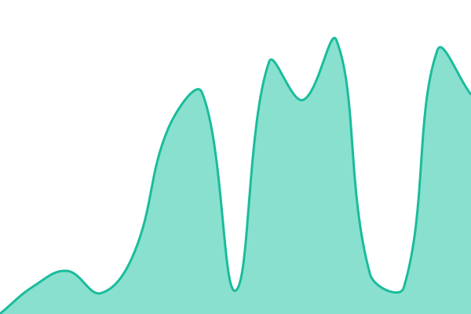
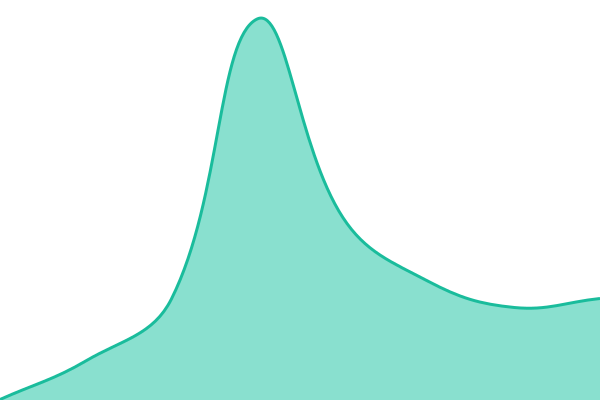

# [📈 Live Status](https://rzrabbi.github.io/upptime): <!--live status--> **🟧 Partial outage**

This repository contains the open-source uptime monitor and status page for [Rezaye Rabbi](rzrabbi.com), powered by [Upptime](https://github.com/upptime/upptime).

With [Upptime](https://upptime.js.org), you can get your own unlimited and free uptime monitor and status page, powered entirely by a GitHub repository. We use [Issues](https://github.com/rzrabbi/upptime/issues) as incident reports, [Actions](https://github.com/rzrabbi/upptime/actions) as uptime monitors, and [Pages](https://rzrabbi.github.io/upptime) for the status page.

<!--start: status pages-->
<!-- This summary is generated by Upptime (https://github.com/upptime/upptime) -->
<!-- Do not edit this manually, your changes will be overwritten -->
<!-- prettier-ignore -->
| URL | Status | History | Response Time | Uptime |
| --- | ------ | ------- | ------------- | ------ |
|  [rzrabbi.com (Personal Site)](https://rzrabbi.com) | 🟩 Up | [rzrabbi-com-personal-site.yml](https://github.com/rzrabbi/upptime/commits/HEAD/history/rzrabbi-com-personal-site.yml) | 

 283ms
     
 | 

<a href="https://rzrabbi.github.io/upptime/history/rzrabbi-com-personal-site">100.00%</a>
    

|  [Rushy Bird (Game)](https://rzrabbi.itch.io/rushy-bird) | 🟩 Up | [rushy-bird-game.yml](https://github.com/rzrabbi/upptime/commits/HEAD/history/rushy-bird-game.yml) | 

 124ms
     
 | 

<a href="https://rzrabbi.github.io/upptime/history/rushy-bird-game">100.00%</a>
    

|  Rushy Bird (Leaderboard API) | 🟥 Down | [rushy-bird-leaderboard-api.yml](https://github.com/rzrabbi/upptime/commits/HEAD/history/rushy-bird-leaderboard-api.yml) | 

 78ms
     
 | 

<a href="https://rzrabbi.github.io/upptime/history/rushy-bird-leaderboard-api">70.23%</a>
    

<!--end: status pages-->

[**Visit our status website →**](https://rzrabbi.github.io/upptime)

## 📄 License

- Powered by: [Upptime](https://github.com/upptime/upptime)
- Code: [MIT](./LICENSE) © [Anand Chowdhary](https://anandchowdhary.com)
- Data in the `./history` directory: [Open Database License](https://opendatacommons.org/licenses/odbl/1-0/)
